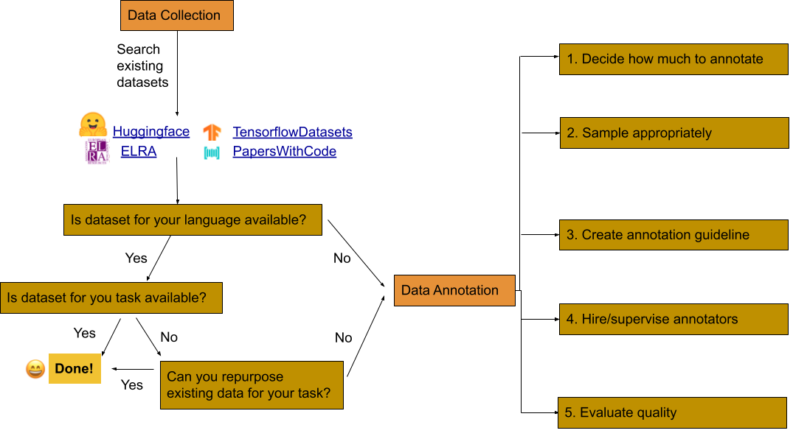
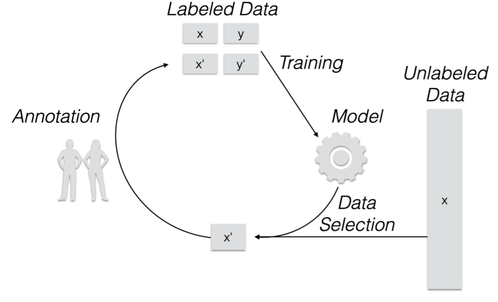

# Data Collection

Here is a flowchart to get you started with data collection for your language and task:

If you are unable to find/use existing available datasets, then you need to collect data for your language/task.
One of the key steps for training high-quality models is to have availability of high-quality labeled data.
However, often collecting such high-quality labeled data requires human effort which is both time-consuming and costly, even more so when human annotators are not native speakers of the language of interest.
***Active learning (AL)*** offers methods that help train models with less human effort and cost by selecting such a subset of data that maximizes the end-model (e.g. POS model) performance.
The key idea being that not all training samples are necessary to train a good model as some samples may offer more information than others for the end model to perform sufficiently well.

## Active Learning Overview
Here is an overview of the AL process:
1. Given an initial trained model and a large pool of unlabeled data, sample a portion of data based on a query strategy.
2. Present the selected data to human annotators to label the data and add it to a pool of labeled data.
3. Train the model with the labeled data acquired so far and use it sample more data from the unlabeled data pool
Continue this process until you have exhausted your unlabeled pool or attained an acceptable level of accuracy.

## Popular Active Learning Strategies
TODO: maybe add task-wise and link to code/paper/tools already available.

## Helpful Reading Material
* [Active Learning Survey](http://burrsettles.com/pub/settles.activelearning.pdf)

# Annotation Tools
TODO: Add links to publicly free available tools for annotation
